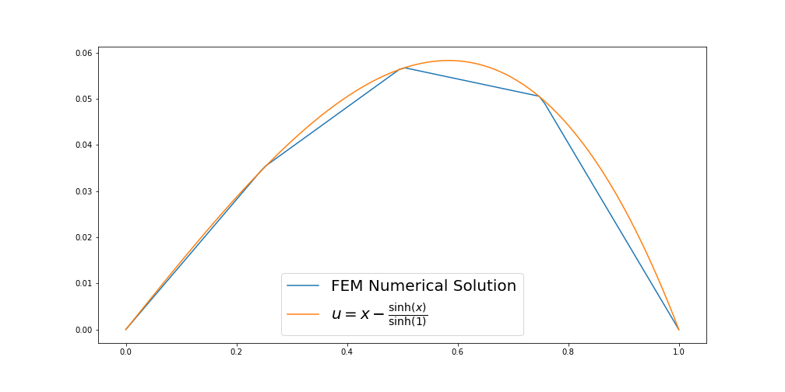

# FEM
This programs solves a simples edo by the finite element method.

It uses the Arg-parser from Igor Mironchick. It is great. Check it out. https://github.com/igormironchik/args-parser

To build:
'''
mk build && cd build
cmake ..
make
'''

Example of use
'''
./fem --npoints 5 --alpha 1 --beta 0 --gamma 1 -t 100 >> data.csv
'''

That solves the following problem:

$$-\alpha u'' + u = x.$$

This is the numerical solution compared to the exact solution.

